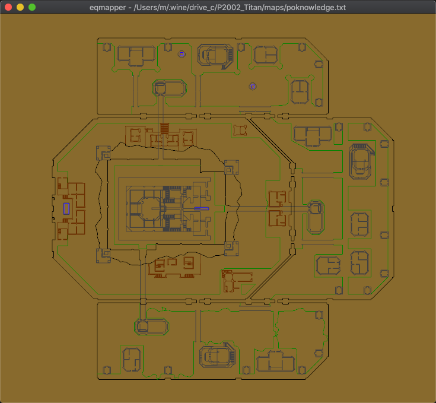

# About

Map viewer for Everquest maps.

## Usage

    cargo run --release ~/.wine/drive_c/P2002_Titan/maps/poknowledge.txt

## Hotkeys

    0 - toggle base layer
    1, 2 and 3 - toggle layer 1, 2 and 3
    R - reset position and zoom, show all layers

## TODO

- strip layer part and find proper map automatically (if given pok_2.txt arg, find and use base map)
- automatically find map boundaries and a sane default zoom when map is loaded
- automatically find good zoom min-max (example: current defaults work well with poknowledge, works bad with southro)
- browser version
- LATER: editing features
- LATER: draw DOT at each label position (piston has no easy draw dot feature, see lyon)
- LATER: toggle show text labels
- LATER: view and rotate map in 3D
- LATER: drag and drop map file onto window to load it

## License

Under [MIT](LICENSE)
